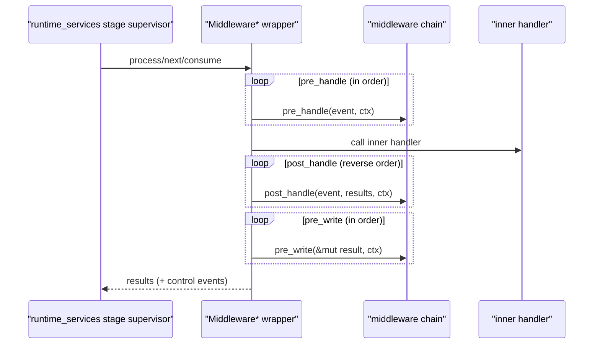

# ObzenFlow Adapters

This crate is an internal implementation detail of the ObzenFlow project. It provides:

- Stage adapters (ready-to-use sources and sinks).
- A composable middleware system (observability, resilience, and integration glue).
- Monitoring exporters and taxonomy helpers.

Most users should depend on the top-level `obzenflow` crate instead.

## Architecture (maintainer guide)

ObzenFlow follows an onion architecture. Inner crates define business-domain abstractions, and outer crates provide runtime/infrastructure implementations that depend on inner crates.Implementation details are injected inward via traits and composition.

**Layer:** Adapters (outer). Depends on `obzenflow_runtime_services` and `obzenflow_core`.

### Handler adapter pattern (middleware wrappers)

The runtime/services layer defines handler traits (sources/transforms/sinks/stateful/join). This crate provides wrapper types that:

- Implement the same handler traits as the wrapped handler.
- Invoke middleware hooks before/after calling the inner handler.
- Enrich output events just before they are written to the journal (“wide events” via `pre_write`).

The runtime only sees “a handler”, and stays middleware-agnostic.

In practice:
1. A user (or outer layer) provides a handler implementation.
2. The DSL/orchestration layer (or infrastructure) wraps the handler with system + user middleware.
3. The runtime receives the wrapped handler and calls the handler trait methods normally.

Concrete wrapper types:
- Transforms: `MiddlewareTransform` / `AsyncMiddlewareTransform` (`src/middleware/transform_middleware.rs`)
- Sinks: `MiddlewareSink` (`src/middleware/sink_middleware.rs`)
- Sources: `MiddlewareFiniteSource`, `MiddlewareInfiniteSource`, `MiddlewareAsyncFiniteSource`, `MiddlewareAsyncInfiniteSource` (`src/middleware/source_middleware.rs`)
- Join: `MiddlewareJoin` (`src/middleware/join_middleware.rs`)
- Stateful: `MiddlewareStateful` (`src/middleware/stateful_middleware.rs`)

Each handler type also has a small builder/extension API (e.g. `TransformHandlerExt::middleware()`) to make wrapping ergonomic.

Middleware call order is as follows.

### Middleware core concepts

#### Hook lifecycle

Middleware is modeled as a small set of hooks around event processing:
- `pre_handle`: gate/skip/abort before calling the inner handler
- `post_handle`: observe outputs (no mutation)
- `on_error`: error policy hook (used primarily by sinks)
- `pre_write`: last chance to mutate/enrich output events before they are journaled

#### `MiddlewareContext` is intentionally ephemeral

`MiddlewareContext` exists only for a single event as it moves through the middleware chain. It carries three kinds of data (`src/middleware/context.rs`, plus a deeper design note in `src/middleware/README.md`):

- `events: Vec<MiddlewareEvent>`: in-memory coordination so middleware layers can communicate without tight coupling.
- `baggage: HashMap<String, Value>`: shared ephemeral state (e.g., timing start time, retry attempt counters).
- `control_events: Vec<ChainEvent>`: durable events that MUST be appended to the handler outputs and written to the journal.

All wrapper types are responsible for appending `control_events` to the handler’s outputs and running `pre_write` over those control events as well.

#### Error-marking is part of the contract

Several wrappers convert “handler returned `Err`” into an error-marked event, rather than aborting the pipeline immediately. Example: transform wrappers (`src/middleware/transform_middleware.rs`) turn a `HandlerError` into `event.mark_as_error(..)` so control middleware (e.g., circuit breaker) can observe outcomes using `ErrorKind` and `ProcessingStatus`.

This also supports dead-letter patterns: transform wrappers short-circuit (pass-through) events already marked with `ProcessingStatus::Error`, so failures don’t cascade or loop indefinitely.

### Factory pattern (stage-aware middleware)

Most middleware is constructed via `MiddlewareFactory` (`src/middleware/middleware_factory.rs`) rather than directly. This defers creation until the stage is being built and the runtime has full context:

- `StageConfig` (stage id/name, etc.)
- A flow-scoped `ControlMiddlewareAggregator` (see below)

Factories also provide static metadata used for safety validation and topology observability:
- `supported_stage_types()`
- `safety_level()` + `hints()` (see `src/middleware/hints.rs`, `src/middleware/middleware_safety.rs`)
- `config_snapshot()` (structural config for topology endpoints)
- Optional `create_control_strategy()` to integrate with runtime control/drain semantics (`ControlEventStrategy` in `obzenflow_runtime_services`)

Safety checks live in `src/middleware/system/validate_safety.rs` and are intended to catch known-footgun combinations early (e.g., “dropping control events on sinks”).

### Control middleware aggregation (flow-scoped state)

Some middleware has runtime state that other layers need to observe (without global state).
`ControlMiddlewareAggregator` (`src/middleware/control/provider.rs`) is created once per flow and passed into factories so instances can register:

- Circuit breaker snapshotters/state/contract info
- Rate limiter snapshotters

The runtime/services layer can then query these via the `obzenflow_core::control_middleware::ControlMiddlewareProvider` trait to enrich wide events and enforce contract behavior.

### Built-in middleware (catalog)

This crate contains a “batteries included” set of middleware factories (plus the wrapper system above):

- Observability (`src/middleware/observability/`)
  - `SystemEnrichmentMiddleware`: ensures `FlowContext` is populated; generates correlation IDs for source events.
  - `TimingMiddleware`: sets `processing_info.processing_time` via the `pre_write` hook.
  - `BoundaryTrackingMiddleware` / `FlowBoundaryTracker`: flow entry/exit tracking.
  - `LoggingMiddleware`: concrete logging middleware used for testing/demos.
- Control/resilience (`src/middleware/control/`)
  - `CircuitBreakerFactory` / `CircuitBreakerBuilder`: configurable open/half-open behavior, optional fallbacks, and rate-based modes.
  - `RateLimiterFactory`: token-bucket rate limiting with durable lifecycle/summary events.
  - Cycle protection is implemented in stage supervisors (FLOWIP-051l), not via middleware.
- State (`src/middleware/state/`)
  - `WindowingMiddlewareFactory`: time-window aggregation; integrates with `WindowingStrategy` to delay EOF so windows can flush.
- System (`src/middleware/system/`)
  - `OutcomeEnrichmentMiddlewareFactory`: classifies `ProcessingStatus` consistently for downstream metrics/UX.
  - `validate_middleware_safety`: static validation utilities for pipeline construction.

### Source wrappers: polling and synthetic events

Source handlers are structurally different from transforms/sinks: `next()` returns events but does not take an input event.
To keep middleware semantics uniform, source wrappers create a synthetic event (type: `system.source.next`) and run middleware against it.

Notable behaviors in `src/middleware/source_middleware.rs`:
- Selected “gating” middleware is run before polling the inner source (currently identified by stable `middleware_name()` strings such as `circuit_breaker` and `rate_limiter`).
- Async source wrappers can enforce an optional poll timeout to prevent permanently stuck polls (finite sources default to a timeout; infinite sources default to none).
- Source errors are converted into a durable observability event (`source.poll_error`) and marked with an appropriate `ErrorKind`, so downstream monitoring sees failures as events.

## Built-in stage adapters (sources and sinks)

These are concrete handler implementations you can use directly (or that the DSL may assemble for you).

### Sources (`src/sources/`)

- `CsvSource` (`src/sources/csv.rs`): synchronous `FiniteSourceHandler` reading a CSV/TSV file in chunks; supports header inference, column selection, and typed or stringly-typed (`CsvRow`) payloads.
- `HttpSource` (`src/sources/http.rs`): `AsyncInfiniteSourceHandler` that converts `EventSubmission` items received over a `tokio::mpsc::Receiver` into `ChainEvent`s; can periodically emit ingestion telemetry as observability events.
- `HttpPullSource` / `HttpPollSource` (`src/sources/http_pull.rs`): HTTP pagination/polling sources driven by a user-supplied `PullDecoder`:
  - `HttpPullSource`: finite “drain until exhausted” mode (`AsyncFiniteSourceHandler`)
  - `HttpPollSource`: infinite “poll forever with cadence” mode (`AsyncInfiniteSourceHandler`)

The HTTP pull/poll stack includes:
- `PullDecoder` + `CursorlessPullDecoder` traits (request building + response decoding + cursor management)
- Typed error model (`DecodeError`) with rate-limit + backoff support
- Low-volume telemetry snapshots emitted as `http_pull.snapshot` observability events

Run the decoder examples with:
`cargo run -p obzenflow_adapters --example http_pull_decoders`

### Sinks (`src/sinks/`)

- `ConsoleSink` (`src/sinks/console.rs`): typed sink that prints decoded payloads to stdout/stderr; includes reusable formatters (JSON, debug, tables).
- `CsvSink` (`src/sinks/csv.rs`): sink that writes data-event payloads to CSV/TSV with buffering, header control, and append safety checks.

## Monitoring (exporters + taxonomies)

Metric collection is derived from wide events and journals in the runtime layer. This crate focuses on:

- Export: implementations of `obzenflow_core::metrics::MetricsExporter` (Prometheus, console summary, etc.).
- Views: “taxonomy” helpers that generate Prometheus queries and dashboard definitions.

### Exporters (`src/monitoring/exporters/`)

- `PrometheusExporter`: renders `AppMetricsSnapshot` + `InfraMetricsSnapshot` to Prometheus text.
- `ConsoleSummaryExporter`: human-friendly summary string (useful for CLI/dev loops).
- `TestExporter`: deterministic exporter for tests.
- `StatsDExporter` (`--features metrics-statsd`): push-style UDP exporter.
- `OtelExporter` (`--features metrics-otel`): placeholder implementation (ensures `--all-features` builds).

`MetricsExporterBuilder` (`src/monitoring/exporters/builder.rs`) supports env-based configuration:
- `OBZENFLOW_METRICS_ENABLED` (`true|false`, default `true`)
- `OBZENFLOW_METRICS_EXPORTER` (`prometheus|console|noop|statsd|opentelemetry`)
- `OBZENFLOW_STATSD_HOST`, `OBZENFLOW_STATSD_PORT` (when `metrics-statsd`)
- `OBZENFLOW_OTEL_ENDPOINT` (when `metrics-otel`)

### Taxonomies (`src/monitoring/taxonomies/`)

Taxonomy structs return query strings and dashboard JSON:
- `RED`, `USE`, `GoldenSignals`, `SAAFE`

## Best practices

Do:
- Implement `middleware_name()` for middleware that needs special orchestration (e.g., source gating).
- Use `MiddlewareContext` for ephemeral coordination; use control events (`ctx.write_control_event`) for durable state changes.
- Use `pre_write` to implement the wide-events pattern (enrichment happens right before journaling).
- Keep middleware factories honest: implement `supported_stage_types()`, `safety_level()`, and `hints()` when behavior has sharp edges.

Avoid:
- Dropping control events on sinks (can break drain semantics and hide failures).
- Infinite retry semantics on sources (sources generate data; they don’t “retry receiving it”).
- Treating “skip” as a silent discard without emitting a durable control/observability event (debugging becomes impossible).

## Recommended module layout

When adding new adapter-layer components, prefer the existing shape:

- Middleware:
  - `src/middleware/<category>/<name>.rs`
  - `src/middleware/<category>/mod.rs` re-exports
  - Factory in the same module if stage context is required
- Sources/sinks:
  - `src/sources/<name>.rs` or `src/sinks/<name>.rs`
  - Re-export from `src/sources/mod.rs` / `src/sinks/mod.rs`
- Monitoring exporters:
  - `src/monitoring/exporters/<name>.rs`
  - Builder/env config remains centralized in `src/monitoring/exporters/builder.rs`

### Where to look

- Crate entrypoints: `src/lib.rs`, `src/middleware/mod.rs`, `src/sources/mod.rs`, `src/sinks/mod.rs`, `src/monitoring/mod.rs`
- Middleware core: `src/middleware/middleware_trait.rs`, `src/middleware/context.rs`, `src/middleware/middleware_factory.rs`
- Wrapper implementations: `src/middleware/*_middleware.rs`
- Control middleware: `src/middleware/control/`
- Observability middleware: `src/middleware/observability/`
- System middleware + validation: `src/middleware/system/`
- HTTP pull/poll sources: `src/sources/http_pull.rs` (+ `examples/http_pull_decoders.rs`)
- Exporters + config: `src/monitoring/exporters/`

## Policies

See `LICENSE-MIT`, `LICENSE-APACHE`, `NOTICE`, `SECURITY.md`, and `TRADEMARKS.md`.
