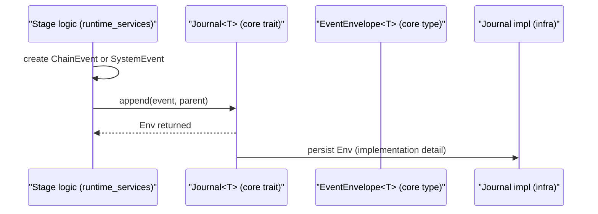

# ObzenFlow Core

This crate is an internal implementation detail of the ObzenFlow project. Most users should depend on the top-level `obzenflow` crate instead.

`obzenflow_core` is the business-domain nucleus of the framework. It defines the *language* the rest of the system speaks:

- Event model (`ChainEvent`, `SystemEvent`, payloads, context blocks)
- Journaling contracts (`Journal<T>`, `JournalReader<T>`, `EventEnvelope<T>`)
- Verification contracts between stages (`Contract` + built-in contracts)
- Metrics/observability interfaces (wide-events DTOs, observer/exporter traits)
- “Ports” for outer layers (HTTP client + web server abstractions, control-middleware ports)
- Strong identifiers and time primitives (typed IDs, `MetricsDuration`)

This crate intentionally avoids infrastructure concerns (storage, networking, async runtimes, logging). Outer layers implement these interfaces and inject them into runtime services.

## Design constraints (maintainers)

- **No I/O**: keep this crate pure types/traits + minimal helpers.
- **Minimal dependencies**: avoid pulling in runtime/framework crates; prefer small, widely used foundational crates.
- **Stable schemas**: many types are serialized into journals/archives; treat changes as schema evolution.
- **Clear boundaries**: if a type needs an implementation (HTTP, web, journaling), define a trait here and implement it in an outer crate.

## Architecture (maintainers)

ObzenFlow follows an onion architecture. Inner crates define business-domain abstractions, and outer crates provide runtime/infrastructure implementations that depend on inner crates. Implementation details are injected inward via traits and composition.

**Layer:** Core (innermost). This crate has no dependencies on other ObzenFlow workspace crates.

### Layering overview

`obzenflow_core` is the innermost workspace crate: it has **no workspace-crate dependencies**, and all other ObzenFlow workspace crates depend on it.

For the exact workspace crate dependency relationships, inspect the workspace `Cargo.toml` and the relevant crate `Cargo.toml`.

### Data plane vs control plane (conceptual)

`obzenflow_core` defines the types that flow through both planes; outer layers wire the concrete behavior.

## Key domain concepts

### Events

ObzenFlow uses two journaled event families:

- **`ChainEvent`** (`src/event/chain_event.rs`): application-level events written to *stage journals* (data plane).
- **`SystemEvent`** (`src/event/system_event.rs`): orchestration and coordination events written to the *system journal* (control plane).

Both are wrapped by **`EventEnvelope<T>`** (`src/event/event_envelope.rs`) when written to a journal. The envelope adds:

- `journal_writer_id`: *which journal* wrote the envelope (`JournalWriterId`)
- `vector_clock`: causal ordering metadata (`VectorClock`)
- `timestamp`: wall-clock timestamp

Only `ChainEvent` and `SystemEvent` can be written to journals: the `JournalEvent` trait is **sealed** (`src/event/journal_event.rs`) to prevent arbitrary event types from being persisted.

#### `ChainEvent` structure and taxonomy

`ChainEvent` is the “wide event” used throughout the data plane. It combines business payloads with context blocks used for tracing, replay, and observability.

Core fields (see `src/event/chain_event.rs`):

- **Identity**
  - `id: EventId` (ULID)
  - `writer_id: WriterId` (stage or system writer)
- **Content** (`ChainEventContent`)
  - `Data { event_type, payload }`: domain facts, user-defined
  - `FlowControl(FlowControlPayload)`: EOF, drain, checkpoints, contracts, etc.
  - `Delivery(DeliveryPayload)`: sink delivery outcomes
  - `Observability(ObservabilityPayload)`: lifecycle/metrics/middleware events
- **Context blocks**
  - `causality: CausalityContext` (parent/ancestor IDs)
  - `flow_context: FlowContext` (flow + stage identifiers)
  - `processing_info: ProcessingContext` (status, timings, hop budget for errors)
  - optional `intent`, `correlation_id` + `correlation_payload`, `replay_context`
  - optional `runtime_context` + `observability` (wide-event instrumentation)

Useful helpers:

- Event classification: `is_data`, `is_control`, `is_delivery`, `is_lifecycle`, `is_eof`
- Error marking: `mark_as_error`, `mark_as_validation_error`, `mark_as_infra_error` (sets `ProcessingStatus` + `error_hops_remaining`)
- Correlation utilities: `with_new_correlation`, `with_correlation_from`, `correlation_latency`

#### Causality and lineage

`CausalityContext` (`src/event/context/causality_context.rs`) records parent event IDs for derived events.

`ChainEventFactory::derived_event` propagates *full lineage* (parent + ancestors) and truncates it to avoid unbounded growth:

- Environment variable: `OBZENFLOW_MAX_LINEAGE_DEPTH`
- Default: `100`
- Implemented in `src/event/chain_event.rs` (see `derived_event`)

Examples of lineage behavior live in `tests/lineage_propagation_test.rs`.

#### Typed payloads (schema support)

`TypedPayload` (`src/event/schema/typed_payload.rs`) provides type-safe conversion between Rust structs and `ChainEvent` data payloads:

- Define a semantic `EVENT_TYPE` (no version suffix).
- Optionally bump `SCHEMA_VERSION`.
- `to_event()` currently emits `"{EVENT_TYPE}.v{SCHEMA_VERSION}"`.
- `from_event()` / `try_from_event()` accept both the unversioned and versioned strings for compatibility.

#### Vector clocks and causal ordering

- `VectorClock` + `CausalOrderingService`: `src/event/vector_clock.rs`
- `EventEnvelope<T>` carries vector clocks so journal reads can be causally ordered.

#### HTTP ingestion schemas

For the “submit events over HTTP” use case, core provides stable request/response DTOs and telemetry counters (no async runtime dependencies):

- Submission types: `EventSubmission`, `BatchSubmission`, `SubmissionResponse` (`src/event/ingestion.rs`)
- Rejection reasons + telemetry: `IngestionRejectionReason`, `IngestionTelemetry` (`src/event/ingestion.rs`)

### Journals

Journals are the persistence boundary between runtime orchestration and the event stream.

Core abstractions:

- `Journal<T>` (`src/journal/journal.rs`): async trait for append + causal reads.
- `JournalReader<T>` (`src/journal/journal_reader.rs`): cursor-style sequential reader to avoid O(n²) scans.
- `JournalError` (`src/journal/journal_error.rs`): domain-level error taxonomy.

Key expectations of a `Journal<T>` implementation:

- `append()` must be atomic and return a fully-populated `EventEnvelope<T>`.
- Implementations are responsible for **vector clock generation** and causal metadata.
- `read_causally_ordered()` must respect happened-before ordering (vector clocks).

Supporting schema/metadata types:

- Ownership and naming: `JournalOwner` (`src/journal/journal_owner.rs`), `JournalName` (`src/journal/journal_name.rs`)
- Replay/archive schemas (no I/O): `ArchiveStatus`/`StatusDerivation` (`src/journal/archive.rs`), `RunManifest` (`src/journal/run_manifest.rs`)

### Contracts (edge verification)

Contracts verify that interactions between stages satisfy defined properties (counts, hashes, delivery accounting, policy overrides, etc.).

Core pieces (`src/contracts.rs`):

- `Contract` trait with hooks `on_write`, `on_read`, and `verify`
- Context objects:
  - `ContractWriteContext` (writer-side state)
  - `ContractReadContext` (reader-side state)
  - `ContractContext` (shared verification view)
- Results:
  - `ContractResult::{Passed, Failed, Pending}`
  - `ContractEvidence`, `ContractViolation`, `ViolationCause`

Built-in contracts:

- `TransportContract`: verifies “events written == events read” (writer count comes from EOF `writer_seq`)
- `SourceContract`: verifies optional “expected_count” evidence against EOF

Concrete examples live in `tests/contracts_transport.rs`.

### Metrics and observability

This crate defines *interfaces and DTOs* for metrics collection; it does not implement exporters or runtime collection loops.

- `MetricsObserver` (`src/metrics/observer.rs`): observer interface notified with `EventEnvelope<ChainEvent>` / `EventEnvelope<SystemEvent>`.
- `MetricsExporter` (`src/metrics/exporter.rs`): exporter interface for Prometheus exposition (dual collection: app-derived + infra-observed).
- Snapshot DTOs (`src/metrics/snapshots.rs`): contracts between aggregators and exporters.
- “Wide event” instrumentation:
  - `RuntimeContext` (`src/event/context/runtime_context.rs`): authoritative counters/gauges embedded into events by supervisors.
  - `ObservabilityContext` (`src/event/context/observability_context.rs`) and `ObservabilityPayload` (`src/event/payloads/observability_payload.rs`): structured lifecycle + middleware + custom metrics events.

### Control middleware ports

Control middleware (circuit breaker, rate limiting) is modeled as *ports* so runtime services can depend on stable interfaces without importing concrete implementations.

See `src/control_middleware.rs`:

- `ControlMiddlewareProvider`: flow-scoped provider of breaker/limiter state + snapshotters
- DTOs: `CircuitBreakerMetrics`, `RateLimiterMetrics`, `CircuitBreakerContractInfo`
- Null implementation: `NoControlMiddleware`

### HTTP + web ports

These modules exist so the runtime can expose endpoints and call outbound HTTP without committing the core to a particular framework.

- Outbound HTTP (`src/http_client/`):
  - `HttpClient` trait + DTOs `RequestSpec`, `HttpResponse`
  - test utility `MockHttpClient`
- Web server (`src/web/`):
  - `WebServer` + `HttpEndpoint`
  - framework-agnostic request/response DTOs
  - configuration: `ServerConfig` and CORS types (`CorsConfig`, `CorsMode`)

### IDs and time

- Strong identifiers (`src/id/`): `FlowId`, `StageId`, `SystemId`, `JournalId` (ULID-based).
- Event identities (`src/event/identity/`): `EventId`, `CorrelationId`, `WriterId`, `JournalWriterId`.
- Safe durations (`src/time/metrics_duration.rs`): `MetricsDuration` stores nanoseconds to prevent unit bugs.

### Build/version information

- `build_info::OBZENFLOW_VERSION` (`src/build_info.rs`) is used for archive compatibility checks and run manifests.

## Schema evolution checklist (maintainers)

Do:
- Add new fields as optional + `#[serde(default)]` when decoding historical journal entries.
- Use tagged enums (`#[serde(tag = ...)]`) for stable event/payload variants.
- Prefer newtypes over raw primitives for domain values (`SeqNo`, `Count`, typed IDs).
- Add round-trip tests for serialized types when changing schemas.

Avoid:
- Renaming serialized fields/variants without a migration plan.
- Removing fields/variants that may exist in persisted journals/archives.
- Introducing heavy dependencies to “just parse/format” inside the core crate.

## Where to look

- Event model: `src/event/`
- Journaling: `src/journal/`
- Contracts: `src/contracts.rs`
- Metrics interfaces/DTOs: `src/metrics/`
- Control middleware ports: `src/control_middleware.rs`
- Web/HTTP ports: `src/web/`, `src/http_client/`
- IDs + time primitives: `src/id/`, `src/time/`

## Policies

See `LICENSE-MIT`, `LICENSE-APACHE`, `NOTICE`, `SECURITY.md`, and `TRADEMARKS.md`.
