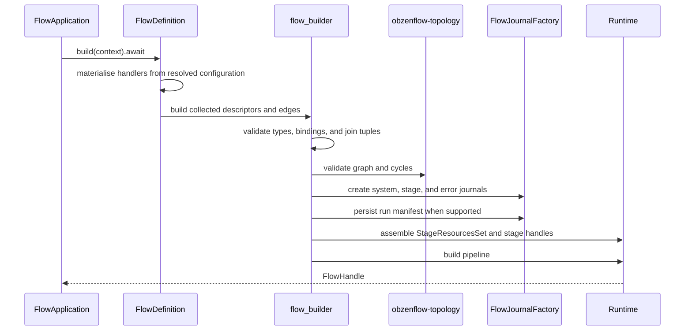

# ObzenFlow flow construction

`obzenflow_dsl` implements the flow construction API exposed by `obzenflow::flow`.
Applications import flow definitions and stage macros from that facade, or its
common `obzenflow::prelude`, and run them with
`obzenflow::application::FlowApplication`.

This is the composition layer. It uses Core contracts, Runtime stage builders,
Adapters, and `obzenflow-topology`. Infra supplies persistence and the application
runner.

## Authoring contract

`flow!` declares a name, journals, stages, and topology. Optional backpressure and
effect-port sections configure construction; middleware attaches to the stage
and live-I/O boundary it protects.

Construct handlers, connectors, and policies inside
`FlowDefinition::materialize`, using the resolved runtime configuration supplied
to that closure. Stage handler and composite-role slots take local names or
identifier-only qualified paths. Calls, closures, builder chains, and struct
literals belong in the preceding bindings. Async source polling timeouts are
handler configuration through `poll_timeout()`.

## Construction pipeline

The macros collect descriptors and edges, lower composites, and return a
deferred `FlowDefinition`. The host resolves configuration before building it.
Ordinary Rust in `flow_builder.rs` owns validation and wiring:



Build failures retain the known run-substrate state so the application can
report partial journals. Exported macros resolve their compiler support through
`$crate`; application callers need only the facade dependency.

## Join topology

Every forward input to a join uses a catalog-first tuple:

```rust,ignore
posted = join!(catalog accounts: Account, Transaction -> Posted => post);
// Inside topology:
(accounts, api_transactions) |> posted;
(accounts, imported_transactions) |> posted;
```

The catalog clause declares the reference binding and type; tuples create the
edges. Multiple stream tuples share one catalog edge. Duplicate tuples, plain
inputs, swapped roles, and unknown bindings fail before journals are created.
Composite outputs resolve against their role types. A composite input port
cannot belong to a join; internal composite joins use
`CompositeBuildContext::join`.

## AI stages

- `inference!` makes one model decision for each already-bounded input.
- `ai_map_reduce!` budgets and chunks input, collects map results, and finalises them.

Both use a declared chat effect and a lexical `EffectBinding<ChatCompletion>`
through `via`. Handlers and roles prepare a `ChatRequestSpec`; the effect boundary
binds the configured target and records the reply for replay. Interpretation
receives the retained spec and reply. The reply itself is framework evidence,
not a selectable stage output.

## Implementation map

| File | Responsibility |
| --- | --- |
| `src/dsl/dsl.rs`, `stage_macros.rs` | Flow and stage macro expansion. |
| `src/dsl/flow_definition.rs` | Deferred construction and build failures. |
| `src/dsl/flow_builder.rs` | Validation, journal allocation, and stage wiring. |
| `src/dsl/typing.rs` | Stage, edge, and effect-fact checks. |
| `src/dsl/composition.rs` | Composite construction contracts. |

## License

Dual-licensed under MIT OR Apache-2.0. See `LICENSE-MIT` and `LICENSE-APACHE`.
