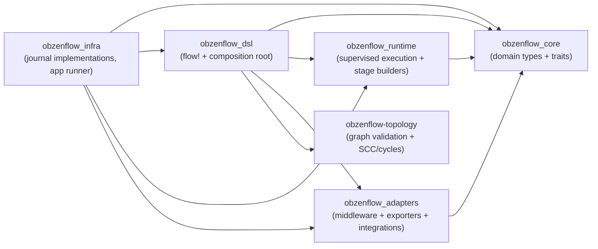
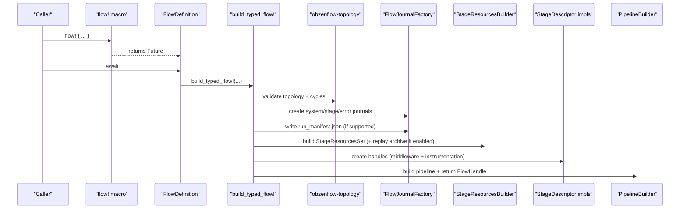

# DSL Build Pipeline (design notes)

This document holds the detailed “how it works” diagrams for `obzenflow_dsl`. The crate-level `README.md` intentionally keeps the architecture overview lightweight.

## Layering overview

## `flow!` expansion model

At a high level, `flow!` collects stage descriptors + topology edges and delegates the heavy lifting to `build_typed_flow!` (`dsl.rs`). The result is wrapped in `FlowDefinition` (`flow_definition.rs`) so runners can accept “DSL flows” explicitly.

