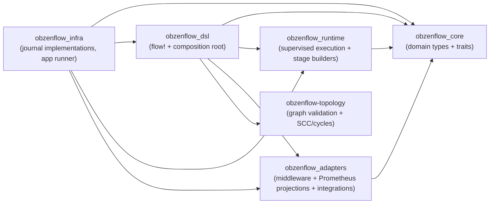
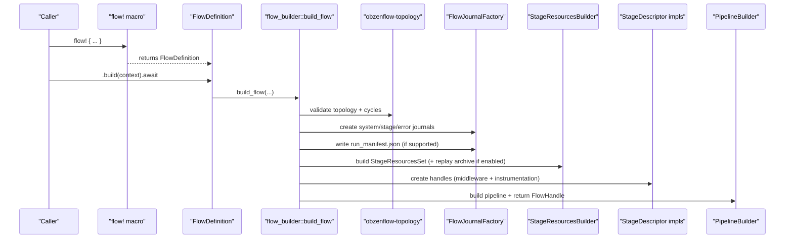

# DSL Build Pipeline (design notes)

This document holds the detailed “how it works” diagrams for `obzenflow_dsl`. The crate-level `README.md` intentionally keeps the architecture overview lightweight.

## Layering overview


```mermaid
flowchart LR
  Core["obzenflow_core<br/>(domain types + traits)"]
  Runtime["obzenflow_runtime<br/>(supervised execution + stage builders)"]
  Adapters["obzenflow_adapters<br/>(middleware + Prometheus projections + integrations)"]
  DSL["obzenflow_dsl<br/>(flow! + composition root)"]
  Infra["obzenflow_infra<br/>(journal implementations, app runner)"]
  Topology["obzenflow-topology<br/>(graph validation + SCC/cycles)"]

  Runtime --> Core
  Adapters --> Core
  Infra --> Core
  DSL --> Core

  DSL --> Runtime
  DSL --> Adapters
  DSL --> Topology

  Infra --> DSL
  Infra --> Runtime
  Infra --> Adapters
```

## `flow!` expansion model

At a high level, `flow!` collects stage descriptors and topology edges, lowers composites, then delegates materialisation to ordinary Rust in `flow_builder.rs`. The macro returns a `FlowDefinition` (`flow_definition.rs`) so runners can accept DSL flows explicitly.


```mermaid
sequenceDiagram
  participant User as "Caller"
  participant Flow as "flow! macro"
  participant Def as "FlowDefinition"
  participant Build as "flow_builder::build_flow"
  participant Topo as "obzenflow-topology"
  participant Journals as "FlowJournalFactory"
  participant Res as "StageResourcesBuilder"
  participant Stages as "StageDescriptor impls"
  participant Pipe as "PipelineBuilder"

  User->>Flow: flow! { ... }
  Flow-->>Def: returns FlowDefinition

  User->>Def: .build(context).await
  Def->>Build: build_flow(...)

  Build->>Topo: validate topology + cycles
  Build->>Journals: create system/stage/error journals
  Build->>Journals: write run_manifest.json (if supported)
  Build->>Res: build StageResourcesSet (+ replay archive if enabled)
  Build->>Stages: create handles (middleware + instrumentation)
  Build->>Pipe: build pipeline + return FlowHandle
```

## Explicit join topology

Every forward input to a join uses a catalog-first tuple:

```ignore
posted = join!(catalog accounts: Account, Transaction -> Posted => post);
// In topology:
(accounts, api_transactions) |> posted;
(accounts, imported_transactions) |> posted;
```

The catalog clause witnesses identity and type. Only tuples create the catalog
and stream edges. Distinct stream tuples share one catalog edge; duplicate tuples,
plain inputs, swapped roles, and unknown bindings fail before journals are created.
Composite outputs resolve against each role's type. A composite input port cannot
belong to a join; private joins require explicit `CompositeBuildContext::join`
wiring between their member roles.

This is journal schema 5.0. Re-record older archives; package versions do not govern
schema admission.
