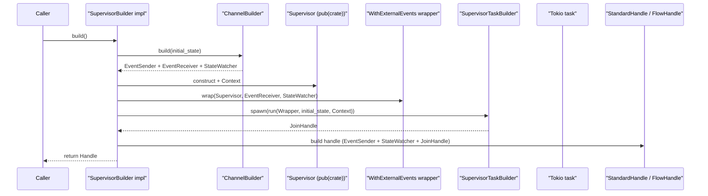
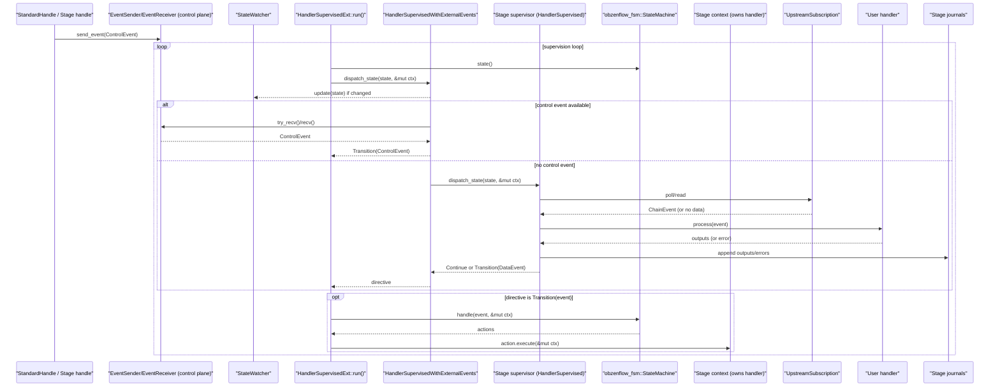
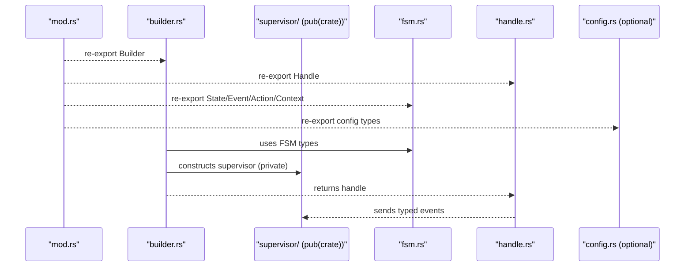

# Supervised Base Infrastructure

This module provides the foundational patterns for building supervised FSMs. Every long-running component in ObzenFlow (pipeline orchestrator, stage supervisors, metrics aggregator) runs inside this infrastructure. Understanding it is essential for working on the runtime.

## Why supervised FSMs?

ObzenFlow is a journal-first event processing framework. Every event is durably written before it is considered processed, and every processing decision is driven by an explicit finite state machine. This is not incidental. The FSM is the single source of truth for what a supervisor is doing, and the supervision loop is the single place where state transitions happen, side effects execute, and errors are handled.

This matters because without it, long-running async tasks develop "shadow state" where the real control flow diverges from the intended state machine. A handler fails, an error propagates via `?`, and suddenly the task terminates without writing a failure event, updating metrics, or draining pending work. The supervised base prevents this by construction: all errors, whether from dispatch logic or from action execution, are funnelled back through the FSM as explicit failure events, and the FSM decides what to do about them.

The architecture has three layers, each with a single responsibility. Understanding these layers and why they exist is the key to working effectively in this codebase.

## The three-layer trait stack

```text
                    ┌─────────────────────────────────┐
                    │  WithExternalEvents (decorator)  │  Bridges control-plane I/O
                    │  Publishes state changes          │  into the dispatch loop
                    └──────────┬──────────────────────┘
                               │ wraps
                    ┌──────────▼──────────────────────┐
                    │  SelfSupervised / HandlerSupervised │  Defines dispatch_state()
                    │  "What does this state do?"         │  per-state I/O and logic
                    └──────────┬──────────────────────────┘
                               │ extends
                    ┌──────────▼──────────────────────┐
                    │  Supervisor (base)               │  Type-level wiring only:
                    │  State, Event, Context, Action   │  builds the FSM
                    └──────────────────────────────────┘
```

### Layer 1: `Supervisor` (base trait, `base.rs`)

The base trait does one thing: it defines the type-level wiring for a supervised component and provides a `build_state_machine(initial_state)` method. It names the `State`, `Event`, `Context`, and `Action` associated types and constructs a `StateMachine` from the `obzenflow_fsm` crate.

This trait is `pub(crate)`. External code never implements it directly. It exists so that `SelfSupervised` and `HandlerSupervised` can share the same type-level foundation without duplicating associated type declarations.

```rust
pub trait Supervisor {
    type State: StateVariant;
    type Event: EventVariant;
    type Context: FsmContext;
    type Action: FsmAction<Context = Self::Context>;

    fn build_state_machine(&self, initial_state: Self::State)
        -> StateMachine<Self::State, Self::Event, Self::Context, Self::Action>;
    fn name(&self) -> &str;
}
```

### Layer 2: `SelfSupervised` and `HandlerSupervised`

These traits add the runtime behaviour: `dispatch_state(state, &mut context)`. This is the method that does the actual work for a given FSM state. It reads from subscriptions, polls timers, calls user handlers, writes to journals, and returns an `EventLoopDirective` telling the run loop what to do next.

The two variants exist because ObzenFlow has two kinds of supervised component:

- **`SelfSupervised`** is for system-level orchestrators that contain their own logic and have no user-provided handler. The pipeline supervisor and metrics aggregator use this. They own their subscription polling, timer management, and coordination logic directly.

- **`HandlerSupervised`** is for stage supervisors that delegate data processing to a user-provided handler stored in the FSM context. Transform, stateful, join, source, and sink supervisors all use this. The supervisor orchestrates the subscription, backpressure, contracts, and lifecycle, while the handler processes individual events.

Both traits define the same core method:

```rust
async fn dispatch_state(
    &mut self,
    state: &Self::State,
    context: &mut Self::Context,
) -> Result<EventLoopDirective<Self::Event>, Box<dyn Error + Send + Sync>>;
```

The return type is critical. `dispatch_state` must not perform state transitions itself. It returns one of three directives:

- **`Continue`**: Stay in the current state, run the loop again. Used when there is no data to process yet (idle polling).
- **`Transition(event)`**: An event has occurred that should drive the FSM. The run loop will call `machine.handle(event, &mut context)` to compute the transition and any resulting actions.
- **`Terminate`**: The component is done. The run loop writes a completion event and exits.

This is the "single-gateway" rule. The only code that calls `machine.handle()` and executes FSM actions is the run loop in `SelfSupervisedExt::run()` or `HandlerSupervisedExt::run()`. Supervisors influence what happens by returning directives, never by reaching into the FSM directly.

### Layer 3: `WithExternalEvents` (decorator, `with_external_events.rs`)

This is the piece that often confuses newcomers, but it solves a real problem and the design is deliberate.

**The problem.** Every supervisor needs to react to external control-plane events (Start, BeginDrain, Stop, etc.) sent by its handle. But the supervisor's `dispatch_state` method is already doing state-specific work: polling subscriptions, processing data, managing timers. If every supervisor also had to check the control channel in every state, that logic would be duplicated across every supervisor and every state handler, and it would be easy to forget a check in one state, creating a subtle bug where a stop command is ignored.

**The solution.** `HandlerSupervisedWithExternalEvents` and `SelfSupervisedWithExternalEvents` are decorator structs that wrap a supervisor and intercept `dispatch_state`. Before delegating to the inner supervisor's dispatch logic, the wrapper:

1. **Publishes state changes** to the `StateWatcher` (watch channel), but only when the FSM state actually changes. This is how external observers (handles, the pipeline supervisor, tests) see the current state without polling.

2. **Checks the external control channel** according to an `ExternalEventMode` policy that varies by FSM state:
   - **`Block`**: `recv().await` until a control event arrives. Used for startup gates (`Created`, `WaitingForGun`) where the supervisor must not begin work until explicitly told to start.
   - **`Poll`**: `try_recv()` once per iteration, then proceed with normal work if empty. Used for `Running` and `Draining` states so data-plane processing continues while still reacting quickly to stop commands.
   - **`Ignore`**: Skip the channel entirely. Used for terminal states (`Drained`, `Failed`) where control events are meaningless.

3. **If a control event is available**, returns `Transition(event)` immediately, preempting the inner supervisor's dispatch.

4. **If no control event**, delegates to `self.inner.dispatch_state(state, context)` as normal.

The wrapper never calls `machine.handle()` and never executes FSM actions. It only influences which `EventLoopDirective` the run loop sees. The single-gateway rule is preserved.

**Why a decorator and not a trait method?** Because the control-channel checking is identical across all supervisors (same `ExternalEventMode` logic, same `StateWatcher` publish, same channel-closed mapping). Putting it in a decorator means supervisors only implement their state-specific dispatch logic, and the control-plane bridging is wired once, tested once, and cannot drift. The supervisor itself never sees the `EventReceiver` or `StateWatcher`. It just writes its dispatch logic and the wrapper handles the rest.

**The `ExternalEventPolicy` trait** is the only thing each supervisor must define to configure the wrapper. It has two methods:

```rust
fn external_event_mode(state: &Self::State) -> ExternalEventMode;
fn on_external_event_channel_closed(state: &Self::State) -> Option<Self::Event>;
```

The first returns `Block`, `Poll`, or `Ignore` for each FSM state. The second maps the infrastructure condition "all senders dropped" into an FSM event (typically an error), so even channel failures drive the FSM through its normal failure path rather than silently terminating the task.

**Exception: async source supervisors.** Some supervisors embed control-channel checking directly instead of using the wrapper, because they need finer-grained responsiveness while awaiting long-running operations (for example, `select!` between handler polling and external events during a backpressure backoff sleep). Even in those cases, the single-gateway rule still holds: the supervisor returns `Transition(event)` and the run loop drives the FSM.

## The run loop

Both `SelfSupervisedExt::run()` and `HandlerSupervisedExt::run()` implement the same core loop. This is the heart of the system and the only place where FSM transitions and side effects happen:

```text
loop:
  state = machine.state()
  directive = supervisor.dispatch_state(state, &mut ctx)
  match directive:
    Continue       => yield; next iteration
    Transition(ev) => actions = machine.handle(ev, &mut ctx)
                      for action in actions:
                        action.execute(&mut ctx)
    Terminate      => write_completion_event(); stop
```

### Error recovery in the run loop

The run loop has two error recovery paths, both designed to prevent errors from bypassing the FSM:

1. **`dispatch_state` returns `Err`**: The loop calls `self.event_for_action_error(msg)` to create a supervisor-specific failure event, feeds it to `machine.handle()`, and executes the resulting failure actions. Then it `continue`s the loop. The next iteration sees the new FSM state (typically `Failed`) and returns `Terminate`.

2. **An action's `execute()` returns `Err`**: Same pattern. The error is converted to a failure event, the FSM transitions to a failure state, failure actions execute (writing failure lifecycle events, cleaning up resources), and the loop breaks out of the current action sequence. The next iteration terminates cleanly.

In both cases, the FSM is always the authority. Errors do not cause the task to exit with an opaque panic or propagate via `?`. They drive the FSM through its defined failure path, which ensures lifecycle events are written, metrics are updated, and the pipeline supervisor is notified.

## Construction-time wiring



The builder creates the channels, constructs the supervisor, wraps it with `WithExternalEvents`, spawns the supervision loop as a tokio task, and returns a handle. The handle holds the `EventSender` (to send control events) and `StateWatcher` (to observe state changes). The supervisor holds the `EventReceiver` (via the wrapper). This is a clean split: handles are the public API surface, supervisors are internal task runners.

### Actors (glossary)

- `Caller`: The outer layer that constructs and drives a supervisor via its handle (typically the DSL/infrastructure). Examples: `src/pipeline/builder.rs` and `src/stages/transform/builder.rs`.
- `Builder`: A `SupervisorBuilder` implementation that assembles resources, spawns the task, and returns a handle. See `src/supervised_base/builder.rs`.
- `EventSender` / `EventReceiver`: Typed `tokio::sync::mpsc` channel used for control-plane events (start/stop/drain). See `src/supervised_base/builder.rs`.
- `StateWatcher`: Typed `tokio::sync::watch` wrapper used to publish the current FSM state to observers (`update`, `subscribe`, `current`). See `src/supervised_base/builder.rs`.
- `Handle`: Usually a `StandardHandle<E, S>` built by `HandleBuilder` (and for the pipeline, wrapped by `FlowHandle`). See `src/supervised_base/handle.rs` and `src/pipeline/handle.rs`.
- `Supervisor task`: Spawned via `SupervisorTaskBuilder` and runs `SelfSupervisedExt::run` or `HandlerSupervisedExt::run`. See `src/supervised_base/handle.rs`, `src/supervised_base/self_supervised.rs`, and `src/supervised_base/handler_supervised.rs`.
- `Supervisor`: An internal `pub(crate)` type implementing `Supervisor` plus either `SelfSupervised` or `HandlerSupervised`. Examples: `src/pipeline/supervisor/mod.rs` (SelfSupervised) and `src/stages/transform/supervisor/mod.rs` (HandlerSupervised).
- `Context`: Mutable state passed through the supervision loop and into FSM actions; for stages it typically owns the user handler. Examples: `src/pipeline/fsm.rs` and `src/stages/transform/fsm.rs`.
- `WithExternalEvents` wrapper: Builders wrap the supervisor using `SelfSupervisedWithExternalEvents` or `HandlerSupervisedWithExternalEvents` (in `src/supervised_base/with_external_events.rs`) to bridge `EventReceiver` + `StateWatcher` into `dispatch_state` (and to publish state changes).

## Runtime supervision (stage event loop with user handler invocation)

Stages are typically `HandlerSupervised`: the supervision loop drives an FSM, but stage logic delegates to a user-provided handler stored in the stage context.



Concrete example (transform stage):
- Builder: `TransformBuilder` / `AsyncTransformBuilder` in `src/stages/transform/builder.rs`
- Wrapper: `HandlerSupervisedWithExternalEvents` in `src/supervised_base/with_external_events.rs`
- Supervisor: `TransformSupervisor` in `src/stages/transform/supervisor/mod.rs`
- Context (owns the handler): `TransformContext` in `src/stages/transform/fsm.rs`
- User handler traits: `TransformHandler` / `AsyncTransformHandler` in `src/stages/common/handlers/transform/traits.rs`
- User handler invocation: `handler.process(event).await` in `src/stages/transform/supervisor/running.rs`
- Drain hook: `TransformAction::DrainHandler` calls `ctx.handler.drain().await` in `src/stages/transform/fsm.rs`

## Control strategies: how middleware influences flow control

When a stage supervisor reaches a loop-level decision point, an inbound control signal, an output-commit readiness check, or a source's terminal emission, it does not hard-code what to do. It consults a small set of typed control-strategy hooks that middleware-backed adapters implement. Live I/O attempts themselves, such as source poll, effect invocation, and sink delivery, compose policy as boundary middleware around a single inner future. That keeps the supervisor at the gas/brake/steering level: it sees only typed runtime pedals and reports, not the concrete middleware driving them.

### The problem this solves

Consider what happens when a circuit breaker is in the `HalfOpen` state and an EOF signal arrives. The supervisor's default behaviour is to forward EOF downstream and transition to Draining. The circuit breaker, though, is mid-recovery, probing to see if the downstream service is healthy again. If EOF fires immediately, the stage shuts down before the breaker can complete its recovery probe, and the next run starts from scratch with a breaker that never got to close.

The naive fix would put circuit-breaker-aware `if` statements inside the supervisor's control-signal handling. The supervisor should not know about circuit breakers, though. And if windowing middleware also needs to hold EOF to flush its current window, and backpressure needs to stall a producer, the supervisor becomes a tangle of middleware-specific conditionals. The hooks keep loop-level concerns in their own policy, consulted by the supervisor through a typed contract. Pacing and breaker checks around live I/O use the boundary-onion shape instead, so the supervisor never becomes the policy combinator.

### Four hooks, one driving vocabulary

The supervisor consults four hooks, each at its own named decision point. Three of them drive the loop and share the same shape, `Continue` or `Pause`, plus a hook-local stop whose name says what stopping means at that point. The type system keeps an admission rejection distinct from a suppressed signal or a poison EOF, so a stop at one point cannot be mistaken for a stop at another. The fourth hook observes and never steers.

- **`SignalGate`** governs inbound control signals (EOF, Drain, Watermark, Checkpoint). It is the live hook today. Its stop is `SuppressSignal`.
- **`AdmissionGate`** governs whether an output commit may proceed at `AdmissionPosition::BeforeOutputCommit`. Its stops are `RejectAttempt` and `SynthesizeFallback`. Live source/effect/sink-delivery attempts do not use this hook; they compose as boundary middleware around the inner future.
- **`CompletionGate`** governs a source's terminal emission, choosing between `DefaultEof` and a `PoisonEof`. It is live on the source FSMs.
- **`AttemptObserver`** observes how an admitted attempt ended. It is a callback, returns nothing, and cannot change the loop. 115c defines it; the binding slices wire it.

`Pause` carries how the supervisor should wait. The signal gate pauses for a relative `Duration`, since time is relative and the supervisor turns it into a deadline when it suspends. The admission gate pauses with a `WakeOn`, which names why and when to re-check: `At(instant)` is self-bounded, `Notify(CreditWaker)` waits on a producer signal and must be paired with a stall cap, and `Immediate` yields once.

### The signal gate

```text
pub trait SignalGate: Send + Sync {
    fn handle_eof(&self, envelope, ctx: &mut ProcessingContext) -> SignalDecision;
    fn handle_watermark(&self, ...) -> SignalDecision;   // default: Continue
    fn handle_checkpoint(&self, ...) -> SignalDecision;  // default: Continue
    fn handle_drain(&self, ...) -> SignalDecision;       // default: Continue
}

pub enum SignalDecision {
    Continue,          // run the runtime's normal rule for this signal
    Pause(Duration),   // hold for a relative duration, then re-resolve
    SuppressSignal,    // drop the signal entirely (the hook-local stop)
}
```

`Continue` lets the runtime apply its normal rule for the signal: forward, forward and drain, buffer at a cycle entry, or suppress a non-terminal signal. `Pause(d)` holds the signal for a relative duration and then re-resolves it. `SuppressSignal` drops the signal, which is dangerous and reserved for signals that are semantically meaningless in context.

`ProcessingContext` is durable scratch the gate carries across calls, so a strategy can count its own deferrals. The `eof_attempts` counter accumulates across `Pause` cycles rather than resetting each call, which is what lets a strategy hold EOF for a bounded number of attempts and then give up.

`JonestownSignalStrategy` is the default gate. It returns `Continue` for every signal, preserving the framework's poison-pill shutdown semantics with no added behaviour.

### Precedence under composition

When more than one strategy is active, `CompositeStrategy` runs all of them and keeps the most restrictive result: `Pause` beats `Continue`, the longest pause wins among several, and `SuppressSignal` beats `Continue`. The most restrictive middleware always wins, which is the safe default.

### How a signal flows through the supervisor

The supervisor calls `resolve_control_event_awaiting_pauses` in `stages/common/supervision/control_resolution.rs`. That helper repeatedly calls the pure `resolve_control_event`, owns any `Pause` wait, and returns only after the signal has resolved to a non-delay runtime action:

```text
Control signal arrives in dispatch_state
    │
    ▼
resolve_control_event_awaiting_pauses(signal, gate, &mut processing_ctx, cycle_config, ...)
    │
    ├── gate.handle_eof() / handle_drain() / ...
    │   returns SignalDecision (Continue / Pause / SuppressSignal)
    │
    ├── Continue:       apply cycle guard and EOF logic
    │                   returns ControlResolution::Ready(ControlAction)
    │   Pause(d)        maps to ControlResolution::Pause(d), waits, then re-resolves
    │   SuppressSignal  maps to ControlResolution::Ready(ControlAction::Skip)
    │
    ▼
Supervisor acts on ControlAction
    ├── Forward:             write signal downstream, return Continue
    ├── ForwardAndDrain:     write signal downstream, return Transition(BeginDrain)
    ├── Suppress:            drop signal, return Continue
    ├── BufferAtEntryPoint:  store signal for later release (cycle convergence)
    └── Skip:                drop signal, return Continue
```

`resolve_control_event` remains pure. It computes the decision without performing I/O. The async helper owns only the bounded pause/re-check loop. The supervisor then executes the delay-free result, by writing to journals or returning the appropriate `EventLoopDirective`. This is the same "decide then act" separation the run loop enforces for FSM transitions.

### Bounded suspension: the one place a pause becomes an await

A gate never awaits. When the supervisor acts on a `Delay`, it calls `suspend_until` in `stages/common/supervision/suspension.rs`, the single place a wake becomes an `await`:

```text
pub(crate) async fn suspend_until(wake: &WakeOn, max_wait: Option<Duration>) -> WakeOutcome
```

`At(instant)` sleeps to the deadline, `Immediate` yields once, and `Notify(credit_waker)` selects between the producer's notify and a stall cap. The bounded-wake rule lives here: every non-source pause is bounded by a deadline or a runtime-supplied stall cap, so a wedged downstream can never hang the loop. A `Notify` wake offered with no cap panics because the cap is part of the runtime contract. The seven former `Delay` sleep sites across the transform, stateful, sink, and join supervisors all route through this helper, which is also the only target the CI barrier-sleep guard needs to police.

### Finalization: settling an attempt exactly once

`AdmittedAttempt`, in the same module, is the loop-driven finalization guard reserved for output-commit/backpressure binding. It holds the observers that admitted an attempt and guarantees each is notified of the terminal outcome exactly once, on every exit path. Calling `settle(outcome).await` runs each observer's synchronous `observe` and then its durable async `settle`. If the guard is dropped without an explicit settle, `Drop` runs only the synchronous `observe` with a default `Aborted` outcome, because `Drop` cannot await durable journal work. By the event-sourcing model, an attempt ended by a drop is simply not recorded as complete and is re-attempted on restart. Live I/O attempts use boundary middleware and policy-owned guards instead.

### Typed registration replaces the dead downcast lane

Earlier, middleware exposed signal strategies through `MiddlewareFactory::create_control_strategy`, a lane no factory overrode, so it always yielded the default, and policy capability was then recovered from an erased `dyn Middleware` by capability-downcast. 115c retires that lane for loop-level controls. A factory now declares which loop-level control points its policy binds through a typed `control_points()`:

```text
pub struct ControlPointRegistration {
    pub signal: bool,
    pub admission_positions: Vec<AdmissionPosition>,
    pub completion: bool,
    pub observation: bool,
}
```

The declaration defaults to none, so purely structural middleware needs no override. Admission remains position-aware so future loop-level gates can be added deliberately, but 115a moves source pre-poll and finite post-poll policy into the source boundary onion, and 120c already uses the same pattern for effects. Until a binding slice installs an admission gate, the live signal gate is the default `JonestownSignalStrategy`, installed during stage materialization.

### Where this lives relative to the supervised base

The control-strategy hooks are not part of `supervised_base` itself. They live in `stages/common/control_strategies/` (the signal, admission, and observation hooks and their vocabulary) and `stages/source/strategies/` (the completion hook), with the suspension helper and finalization guard in `stages/common/supervision/`. The shared resolution helper `resolve_control_event` also lives under `stages/common/supervision/`. The `supervised_base` run loop and the `WithExternalEvents` decorator know nothing about control strategies. They operate at the level of `EventLoopDirective`, one layer above. The supervisor's `dispatch_state` method is the integration point where resolution results become directives.

This separation is deliberate. The run loop owns the FSM lifecycle, its transitions, actions, and errors. The `WithExternalEvents` decorator owns external control-plane bridging, its handle events and state publishing. The control-strategy hooks own middleware-influenced flow control decisions. Each concern has its own module and its own tests, and they compose through the `dispatch_state` return value.

## Recommended module layout

When adding a new supervised component, prefer the standard shape:



For larger supervisors, decompose `supervisor.rs` into `supervisor/mod.rs` with per-state submodules (`running.rs`, `draining.rs`, etc.). Keep each submodule under 600 lines of code. The FSM definition lives in `fsm.rs` as the single source of truth for states, events, actions, and transitions. Never duplicate the `fsm!` block across files.

## Core Components

### 1. SupervisorBuilder Trait
Every supervisor must be created through a builder that implements this trait:
```rust
#[async_trait]
pub trait SupervisorBuilder: Sized {
    type Handle: SupervisorHandle;
    type Error: Error + Send + Sync + 'static;

    async fn build(self) -> Result<Self::Handle, Self::Error>;
}
```

### 2. SupervisorHandle Trait
Every handle must implement this trait for event-based control:
```rust
#[async_trait]
pub trait SupervisorHandle: Send + Sync {
    type Event: Debug + Send + 'static;
    type State: Clone + Debug + Send + Sync + 'static;
    type Error: Error + Send + Sync + 'static;

    async fn send_event(&self, event: Self::Event) -> Result<(), Self::Error>;
    fn current_state(&self) -> Self::State;
    async fn wait_for_completion(self) -> Result<(), Self::Error>;
}
```

### 3. HandleBuilder
A builder for creating handles with proper trait implementation:

```rust
// For standard handles that use HandleError
let handle = HandleBuilder::new()
    .with_event_sender(event_sender)
    .with_state_watcher(state_watcher)
    .with_supervisor_task(task)
    .build_standard()?;

// For custom handles with special error types
let handle = HandleBuilder::new()
    .with_event_sender(event_sender)
    .with_state_watcher(state_watcher)
    .with_supervisor_task(task)
    .build_custom(|sender, watcher, task| {
        MyCustomHandle::new(sender, watcher, task)
    })?;
```

## Key Principles

1. **Single-gateway rule**: Only the run loop calls `machine.handle()` and executes actions. Supervisors return directives, never drive the FSM directly.
2. **Errors drive the FSM**: Every error (from dispatch, from actions) is converted to a failure event and fed back through the FSM. No error silently kills the task.
3. **Decorator for control-plane bridging**: The `WithExternalEvents` wrapper handles channel reads and state publishing so supervisors only implement their state-specific logic.
4. **Builder enforced**: Cannot create handles without going through `SupervisorBuilder` and `HandleBuilder`.
5. **Supervisors are `pub(crate)`**: Handles are the public API. Supervisors are internal. Users interact with the system through handles and the `flow!` DSL.
6. **Context owns mutable state, supervisor owns I/O**: The FSM context holds extended state the FSM reasons about (handler, contract state, pending outputs). The supervisor struct holds long-lived I/O drivers (subscriptions, timers) that are not part of the FSM's decision model.

## What NOT to Do

- Don't create handles manually with a `new()` method. Use `HandleBuilder`.
- Don't expose supervisor structs publicly. They are `pub(crate)`.
- Don't call `machine.handle()` from `dispatch_state`. Return `Transition(event)` instead.
- Don't propagate errors via `?` from `dispatch_state` to skip the FSM failure path. The run loop's error recovery handles this, but `dispatch_state` should handle expected errors internally and only let truly unexpected errors bubble.
- Don't duplicate the `fsm!` definition across files. One canonical definition in `fsm.rs`, one `build_*_fsm()` function.
- Don't put I/O handles (subscriptions, timers) in the FSM context if they can live on the supervisor struct. Context is for state the FSM reasons about, not for input channels.
