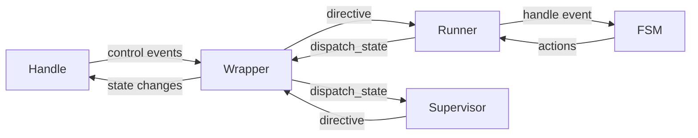

# Runtime supervision

This module supplies the shared state-machine runners used by pipeline, stage,
and metrics supervisors. It is a framework implementation guide; applications
normally use `obzenflow::application::FlowApplication` and stage handler traits.

## Ownership

| Component | Responsibility |
| --- | --- |
| `Supervisor` | Names the state, event, context, and action types and constructs the FSM. |
| `SelfSupervised` | Dispatches system components such as the pipeline and metrics aggregator. |
| `HandlerSupervised` | Dispatches stages that invoke an application handler. |
| Shared `run()` extensions | Drive FSM transitions and execute the resulting actions. |
| `HandlerSupervisedWithExternalEvents` | Bridges stage control channels and state watchers into dispatch. |
| Builders and handles | Assemble resources, own tasks, and expose lifecycle control. |

The FSM context holds state used in decisions, including handler state and
pending work. The supervisor holds I/O drivers such as subscriptions and timers.
The base `Supervisor` trait and concrete supervisors remain crate-private.

## Dispatch and transitions

`dispatch_state` performs the work for the current state and returns a directive.
The shared runner is the only place that calls `machine.handle()` and executes
FSM actions:

```text
loop:
  directive = supervisor.dispatch_state(machine.state(), context)
  Continue       -> yield and dispatch again
  Transition(ev) -> machine.handle(ev, context), then execute its actions
  Terminate      -> await the completion hook and exit
```

A dispatch or action error becomes a supervisor-specific failure event. The
runner feeds that event through the FSM and executes its failure actions.
An action failure abandons the remaining normal actions; subsequent dispatch
follows the failure or settlement state.

Machine errors, hook errors, and failures during error handling can still
return early. Panic and task abortion can skip completion hooks. Task and
publication ownership must therefore retain resources independently of the
normal return path; a task finishing does not by itself prove flow success.

See [the self-supervised runner](self_supervised.rs) and
[the handler-supervised runner](handler_supervised.rs) for the exact paths.

## Construction and external control

A stage builder creates typed channels and an FSM context, wraps the supervisor
with its control-channel adapter, and passes that component to
`SupervisorTaskBuilder`. `HandleBuilder` assembles the sender, state watcher,
and typed supervisor task into a handle. The pipeline uses its own builder
and an opaque `FlowHandle`.


```mermaid
flowchart LR
  Handle -->|control events| Wrapper
  Runner -->|dispatch_state| Wrapper
  Wrapper -->|dispatch_state| Supervisor
  Supervisor -->|directive| Wrapper
  Wrapper -->|directive| Runner
  Runner -->|handle event| FSM
  FSM -->|actions| Runner
  Wrapper -->|state changes| Handle
```

Production task construction selects a shared runner from a typed supervised
component. Raw task construction is restricted to unit fixtures.

Async source builders use the crate-private typed constructor with resource
cleanup. It runs the shared handler runner and awaits cleanup after every orderly
return, inside the same task and publication scope, before completing the handle.
Cleanup preserves a primary runner error and cannot drive FSM transitions or emit
business data or EOF. Source supervisors consume cleanup eligibility before
awaiting, so earlier cleanup in dispatch cannot be repeated. Forced abort and panic
do not guarantee awaited cleanup.

The stage wrapper publishes changed states and applies a control-channel mode:

| Mode | Behavior |
| --- | --- |
| `Block` | Wait for an external command, as at a startup gate. |
| `Poll` | Check for a command and otherwise continue stage work. |
| `CloseAndRecord` | Close admission and journal accepted commands without executing them. |

Terminal command recording runs through retained publication ownership, so
dropping a waiter cannot silently discard the remaining queue. A journal error
remains an error; it cannot certify command disposal.

Async source supervisors check their channels directly when they need to
interrupt a long poll or wait. They retain the same transition rule and terminal
recording helper. The pipeline also multiplexes its own controls, deadlines,
journal input, and resource observations under the shared runner.

See [channel and handle contracts](builder.rs), [task ownership](handle.rs),
[retained publication](publication.rs), and [the stage wrapper](with_external_events.rs).

## Stage policy boundaries

Live source polls, effects, and sink deliveries run through typed boundary
middleware. Supervisor loops consume the resulting reports without knowing
which concrete policy produced them.

Loop-level control hooks live outside this module:

| Hook | Role |
| --- | --- |
| `SignalGate` | Continue, pause, or suppress an inbound control signal. |
| `CompletionGate` | Select normal or poison EOF for source completion. |
| `AdmissionGate` | Contract for output-commit admission. |
| `AttemptObserver` | Observe and settle an admitted attempt. |

`resolve_control_event` decides the runtime action without I/O. Its async
wrapper owns pause and re-check behavior; the supervisor executes the resolved
action. The default `JonestownSignalStrategy` preserves normal signal handling.

Suspension goes through `suspend_until`: `WakeOn::At` waits to a deadline,
`Immediate` yields once, and `Notify` requires a runtime stall cap.
`AdmittedAttempt` is reserved for output-commit/backpressure binding. Explicit
settlement runs synchronous observation and durable async settlement; dropping
it performs only synchronous observation of an aborted attempt.

See [control strategies](../stages/common/control_strategies/mod.rs),
[source completion strategies](../stages/source/strategies/mod.rs), and
[suspension and settlement](../stages/common/supervision/suspension.rs).

## Adding a supervised component

Keep one FSM definition in `fsm.rs`. Use `builder.rs` for construction,
`handle.rs` for external control, and a private `supervisor.rs` or
`supervisor/` directory for state dispatch. Split large supervisors by state.

Return directives from dispatch; let the shared runner drive transitions.
Handle expected errors in the component's failure model and retain resources
across abnormal exits. Keep concrete middleware and storage implementations
outside the shared runner.

The [transform supervisor](../stages/transform/supervisor/mod.rs) and
[pipeline supervisor](../pipeline/supervisor.rs) show the two supervision styles.
