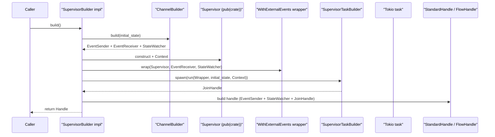
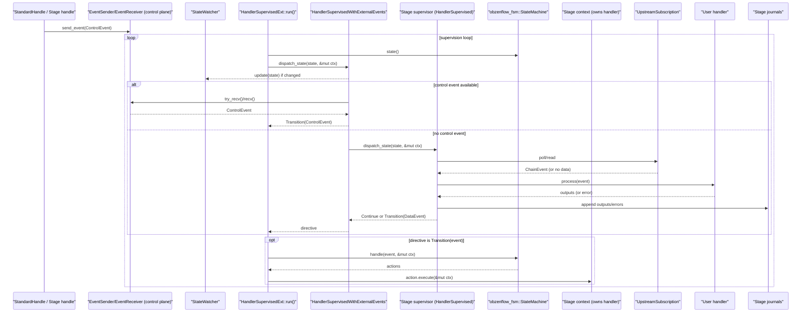
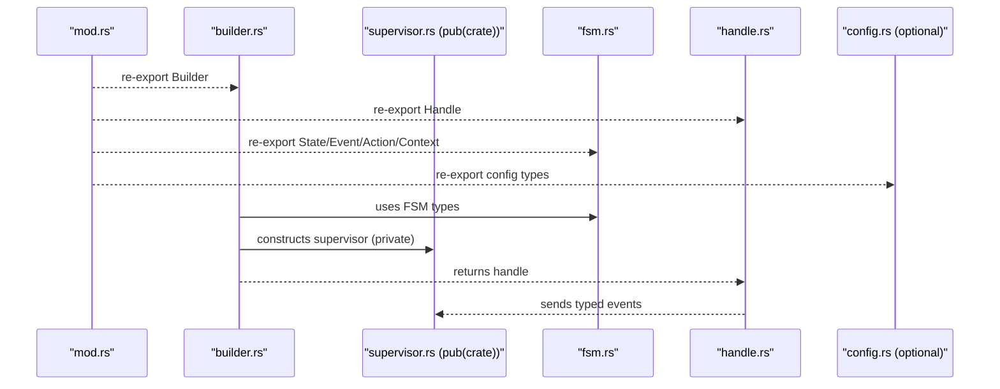

# Supervised Base Infrastructure

This module provides the foundational patterns for building supervised FSMs that follow our strict architectural requirements.

## Supervised FSM pattern (design notes)

ObzenFlow models long-running runtime components as supervised finite state machines (FSMs). It helps to separate:

- **Construction-time wiring**: building/spawning the supervisor task and returning a handle (control plane).
- **Runtime supervision**: the task loop that drives the FSM; for stages this is also where user handler code is invoked (data plane).

### Actors (glossary)

- `Caller`: The outer layer that constructs and drives a supervisor via its handle (typically the DSL/infrastructure). Examples: `src/pipeline/builder.rs` and `src/stages/transform/builder.rs`.
- `Builder`: A `SupervisorBuilder` implementation that assembles resources, spawns the task, and returns a handle. See `src/supervised_base/builder.rs`.
- `EventSender` / `EventReceiver`: Typed `tokio::sync::mpsc` channel used for control-plane events (start/stop/drain). See `src/supervised_base/builder.rs`.
- `StateWatcher`: Typed `tokio::sync::watch` wrapper used to publish the current FSM state to observers (`update`, `subscribe`, `current`). See `src/supervised_base/builder.rs`.
- `Handle`: Usually a `StandardHandle<E, S>` built by `HandleBuilder` (and for the pipeline, wrapped by `FlowHandle`). See `src/supervised_base/handle.rs` and `src/pipeline/handle.rs`.
- `Supervisor task`: Spawned via `SupervisorTaskBuilder` and runs `SelfSupervisedExt::run` or `HandlerSupervisedExt::run`. See `src/supervised_base/handle.rs`, `src/supervised_base/self_supervised.rs`, and `src/supervised_base/handler_supervised.rs`.
- `Supervisor`: An internal `pub(crate)` type implementing `Supervisor` plus either `SelfSupervised` or `HandlerSupervised`. Examples: `src/pipeline/supervisor.rs` (SelfSupervised) and `src/stages/transform/supervisor.rs` (HandlerSupervised).
- `Context`: Mutable state passed through the supervision loop and into FSM actions; for stages it typically owns the user handler. Examples: `src/pipeline/fsm.rs` and `src/stages/transform/fsm.rs`.
- `WithExternalEvents` wrapper: Many builders wrap the supervisor to bridge `EventReceiver` + `StateWatcher` into `dispatch_state` (and to publish state changes). Examples: `SupervisorWithExternalEvents` in `src/pipeline/builder.rs` and `HandlerSupervisedWithExternalEvents` in `src/stages/transform/builder.rs`.

### Construction-time wiring (build + spawn + return handle)



- **Handles** are the public API surface and communicate with supervisors via typed **events**.
- **Supervisors** are internal task runners; they own the event loop and drive the FSM.
- **Context** holds mutable state (behind synchronization primitives when needed); supervisors should mostly hold immutable references.

### Runtime supervision (stage event loop + user handler invocation)

Stages are typically `HandlerSupervised`: the supervision loop drives an FSM, but stage logic delegates to a user-provided handler stored in the stage context.



Concrete example (transform stage):
- Builder: `TransformBuilder` / `AsyncTransformBuilder` in `src/stages/transform/builder.rs`
- Wrapper: `HandlerSupervisedWithExternalEvents` in `src/stages/transform/builder.rs`
- Supervisor: `TransformSupervisor` in `src/stages/transform/supervisor.rs`
- Context (owns the handler): `TransformContext` in `src/stages/transform/fsm.rs`
- User handler traits: `TransformHandler` / `AsyncTransformHandler` in `src/stages/common/handlers/transform/traits.rs`
- User handler invocation: `handler.process(event).await` in `src/stages/transform/supervisor.rs`
- Drain hook: `TransformAction::DrainHandler` calls `ctx.handler.drain().await` in `src/stages/transform/fsm.rs`

This crate supports two flavors:
- `SelfSupervised`: system supervisors that contain orchestration logic (no user handler). Examples: `src/pipeline/supervisor.rs` and `src/metrics/supervisor.rs` run via `SelfSupervisedExt::run` (`src/supervised_base/self_supervised.rs`).
- `HandlerSupervised`: stage supervisors that orchestrate calling user handlers stored in context. Examples: stage builders under `src/stages/**/builder.rs` run via `HandlerSupervisedExt::run` (`src/supervised_base/handler_supervised.rs`). For transforms specifically, user code is invoked from `TransformSupervisor::dispatch_state` (`src/stages/transform/supervisor.rs`) via the handler traits in `src/stages/common/handlers/transform/traits.rs`.

### Recommended module layout

When adding a new supervised component, prefer the standard shape:



## Core Components

### 1. SupervisorBuilder Trait
Every supervisor must be created through a builder that implements this trait:
```rust
#[async_trait]
pub trait SupervisorBuilder: Sized {
    type Handle: SupervisorHandle;
    type Error: Error + Send + Sync + 'static;
    
    async fn build(self) -> Result<Self::Handle, Self::Error>;
}
```

### 2. SupervisorHandle Trait
Every handle must implement this trait for event-based control:
```rust
#[async_trait]
pub trait SupervisorHandle: Send + Sync {
    type Event: Debug + Send + 'static;
    type State: Clone + Debug + Send + Sync + 'static;
    type Error: Error + Send + Sync + 'static;
    
    async fn send_event(&self, event: Self::Event) -> Result<(), Self::Error>;
    fn current_state(&self) -> Self::State;
    async fn wait_for_completion(self) -> Result<(), Self::Error>;
}
```

### 3. HandleBuilder
A builder for creating handles with proper trait implementation:

```rust
// For standard handles that use HandleError
let handle = HandleBuilder::new()
    .with_event_sender(event_sender)
    .with_state_watcher(state_watcher)
    .with_supervisor_task(task)
    .build_standard()?;

// For custom handles with special error types
let handle = HandleBuilder::new()
    .with_event_sender(event_sender)
    .with_state_watcher(state_watcher)
    .with_supervisor_task(task)
    .build_custom(|sender, watcher, task| {
        MyCustomHandle::new(sender, watcher, task)
    })?;
```

## Usage Example

### 1. Define Your Types
```rust
#[derive(Clone, Debug)]
pub enum MyEvent { Start, Stop }

#[derive(Clone, Debug)]
pub enum MyState { Idle, Running }
```

### 2. Create Your Builder
```rust
pub struct MyBuilder {
    config: MyConfig,
    resources: StageResources,
}

#[async_trait]
impl SupervisorBuilder for MyBuilder {
    type Handle = StandardHandle<MyEvent, MyState>;
    type Error = BuilderError;
    
    async fn build(self) -> Result<Self::Handle, Self::Error> {
        // Create channels
        let (event_sender, event_receiver, state_watcher) = 
            ChannelBuilder::new().build(MyState::Idle);
        
        // Create supervisor (private!)
        let supervisor = MySupervisor { /* ... */ };
        
        // Spawn task
        let task = SupervisorTaskBuilder::new("my_supervisor")
            .spawn(|| async { supervisor.run().await });
        
        // Build handle using HandleBuilder
        HandleBuilder::new()
            .with_event_sender(event_sender)
            .with_state_watcher(state_watcher)
            .with_supervisor_task(task)
            .build_standard()
            .map_err(|e| BuilderError::Other(e.to_string()))
    }
}
```

### 3. For Custom Error Types

If you need a custom error type (like FlowError), create a custom handle:

```rust
pub struct MyHandle {
    event_sender: EventSender<MyEvent>,
    state_watcher: StateWatcher<MyState>,
    supervisor_task: Option<JoinHandle<...>>,
}

impl MyHandle {
    fn new(sender: EventSender<MyEvent>, watcher: StateWatcher<MyState>, task: JoinHandle<...>) -> Self {
        Self {
            event_sender: sender,
            state_watcher: watcher,
            supervisor_task: Some(task),
        }
    }
}

#[async_trait]
impl SupervisorHandle for MyHandle {
    type Event = MyEvent;
    type State = MyState;
    type Error = MyCustomError;
    
    async fn send_event(&self, event: Self::Event) -> Result<(), Self::Error> {
        self.event_sender.send(event).await
            .map_err(|e| MyCustomError::from(e))
    }
    
    fn current_state(&self) -> Self::State {
        self.state_watcher.current()
    }
    
    async fn wait_for_completion(mut self) -> Result<(), Self::Error> {
        // Custom implementation with error conversion
    }
}

// In your builder:
async fn build(self) -> Result<Self::Handle, Self::Error> {
    // ... setup channels and task ...
    
    HandleBuilder::new()
        .with_event_sender(event_sender)
        .with_state_watcher(state_watcher)
        .with_supervisor_task(task)
        .build_custom(MyHandle::new)
        .map_err(|e| BuilderError::Other(e.to_string()))
}
```

## Key Principles

1. **No Macros** - Explicit is better than implicit
2. **Builder Enforced** - Can't create handles without proper setup
3. **Type Safety** - All components are properly typed
4. **Error Flexibility** - Support both standard and custom error types
5. **Consistent Pattern** - All supervisors follow the same structure

## What NOT to Do

❌ Don't create handles manually with a `new()` method
❌ Don't expose supervisor structs publicly
❌ Don't implement SupervisorHandle without using HandleBuilder
❌ Don't bypass the builder pattern
